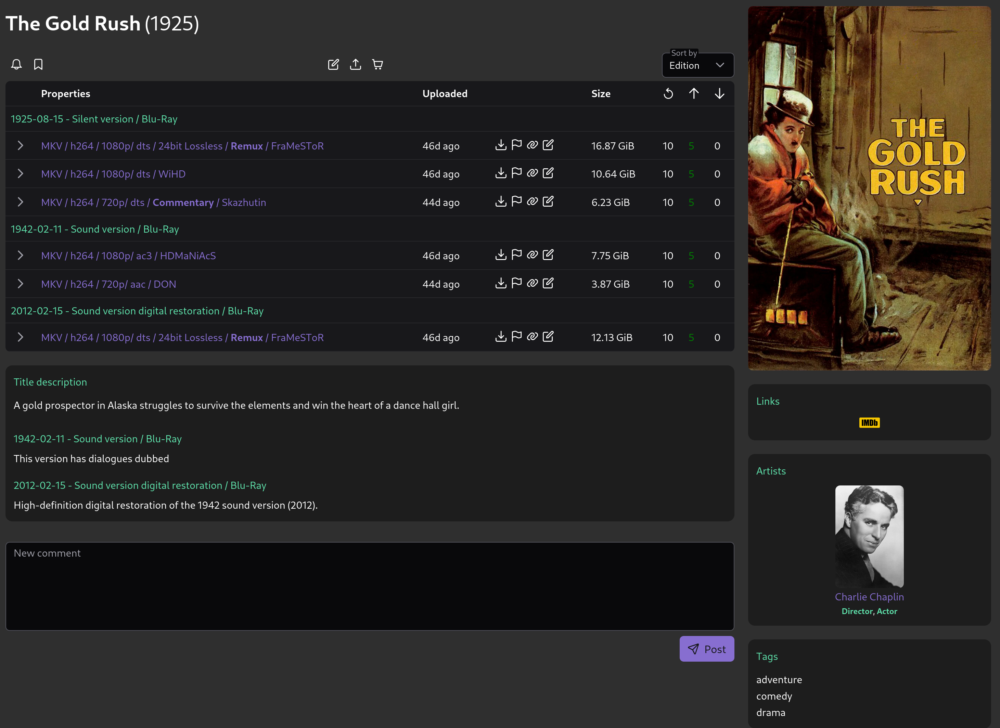
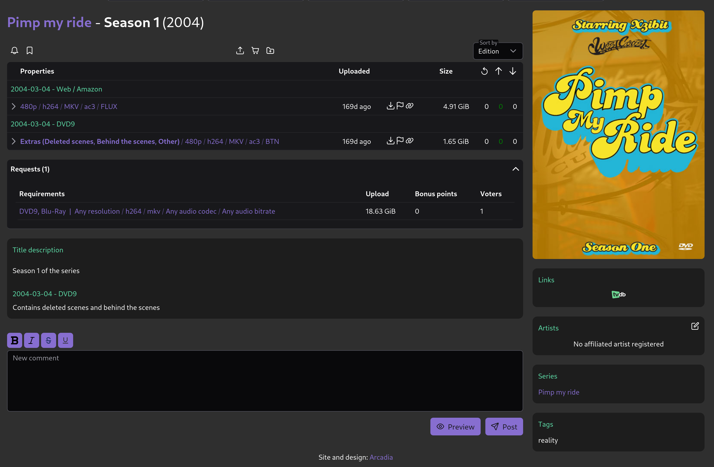
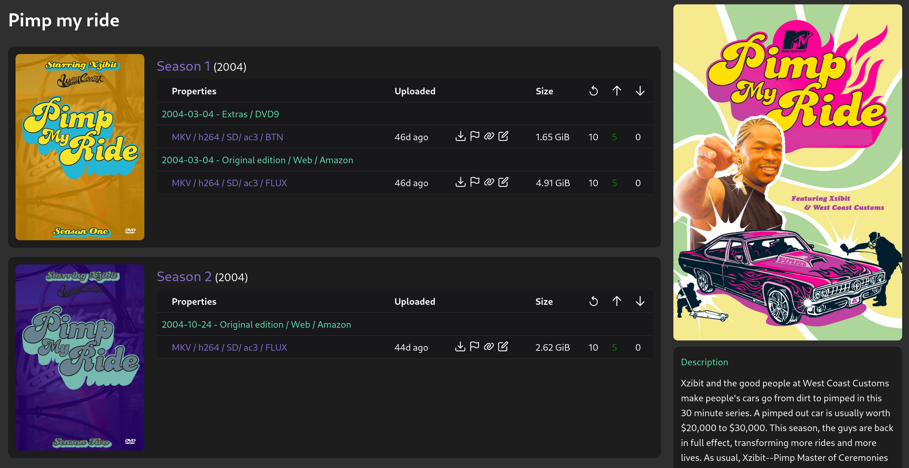
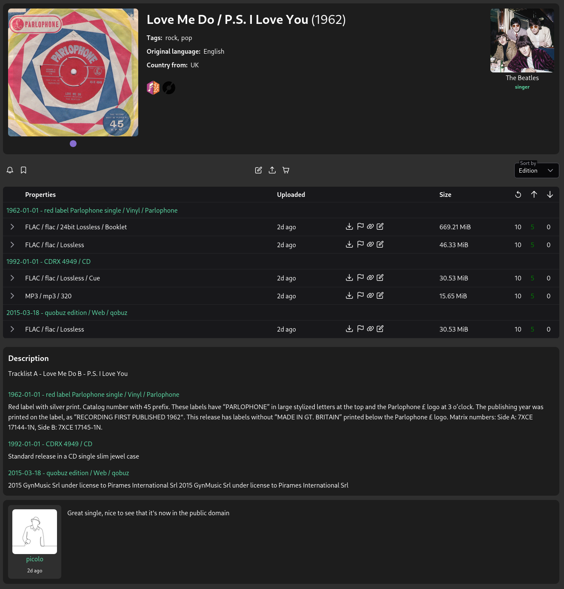
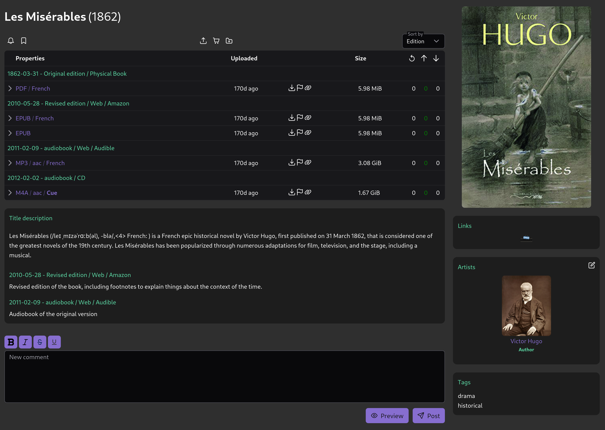
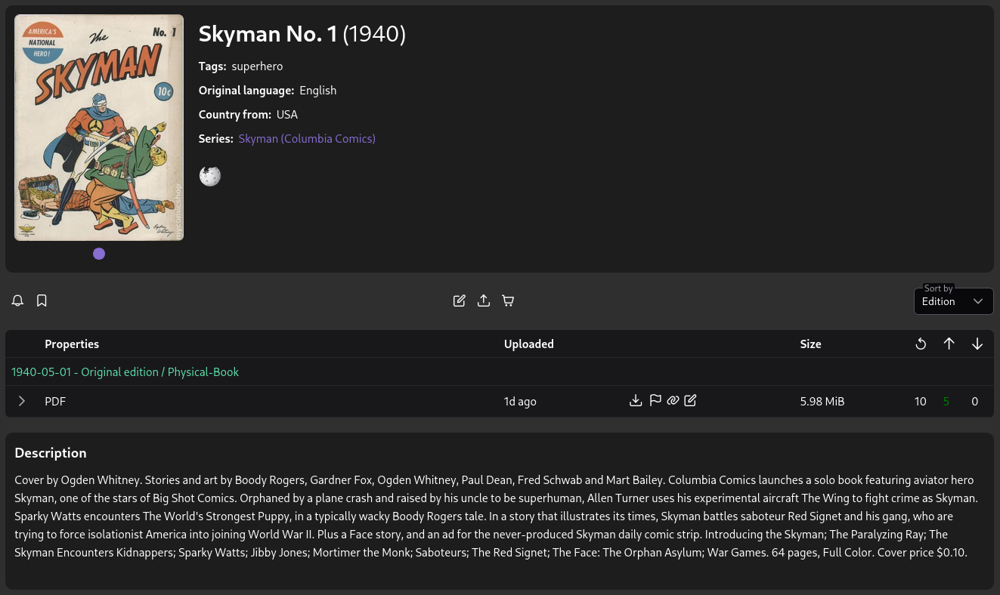
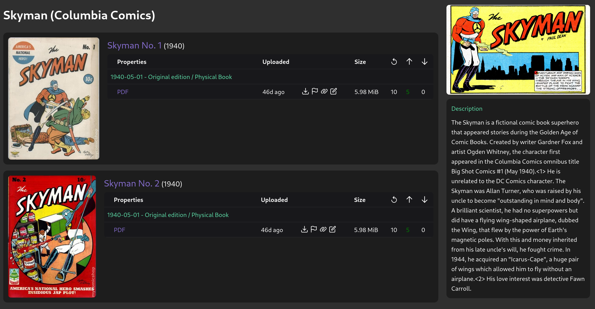
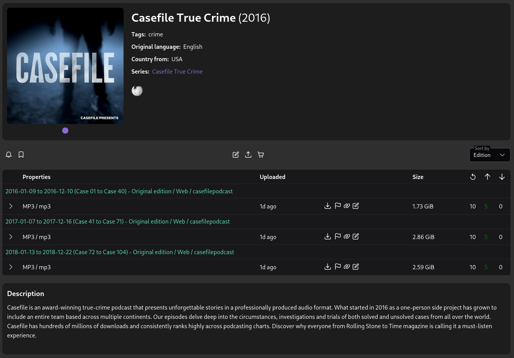

# Arcadia

Arcadia is a torrent site and tracker, aiming at providing an **easy to setup** and **configurable**, **highly organized** and **content agnostic** platform.

The backend is built with Rust for speed and safety. The frontend is built with Typescript and VueJS, rendered client-side. 

  

For contributions see [backend/CONTRIBUTING.md](backend/CONTRIBUTING.md) or [frontend/CONTRIBUTING.md](frontend/CONTRIBUTING.md)

## Screenshots

Here are some examples of what type of content can be hosted with Arcadia, and how it can look like.

### Movies

### TV Shows

#### Season entry

#### Series view

### Software

#### Video-Game

### Music

### Books (ebooks and audiobooks)

### Book series

#### Entry view

#### Series view

### Collections

Collections represent a "grouping" of content, to avoid having multiple uploads to do and to limit the load on the tracker. This can be useful for site-dumps, full/finished series, monthly/yearly grouping of content etc.

#### Example with a podcast

## Acknlowedgements

- Thanks to [GazellePW](https://github.com/Mosasauroidea/GazellePW/) for their mediainfo and bdinfo parsers written in js
- [BBcode renderer plugin](https://github.com/JiLiZART/BBob/issues/125#issuecomment-1774257527) for line breaks

## Notes

This tool (Arcadia) is intended for legal use only. Users (both the ones hosting Arcadia and the ones using it) are solely responsible for the content they download and share through it. Downloading or distributing copyrighted material without proper authorization is illegal in most jurisdictions. By hosting and/or using Arcadia, you agree to abide by all applicable laws and respect intellectual property rights. The developers of Arcadia assume no responsibility for any illegal activities conducted by its hosters and users.
