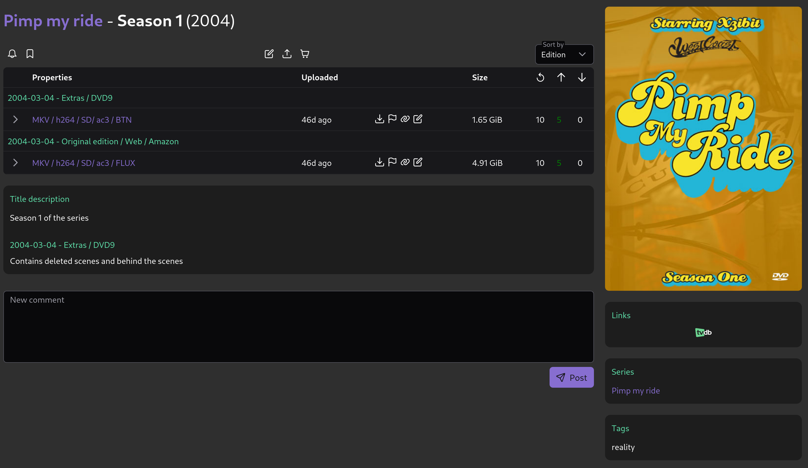
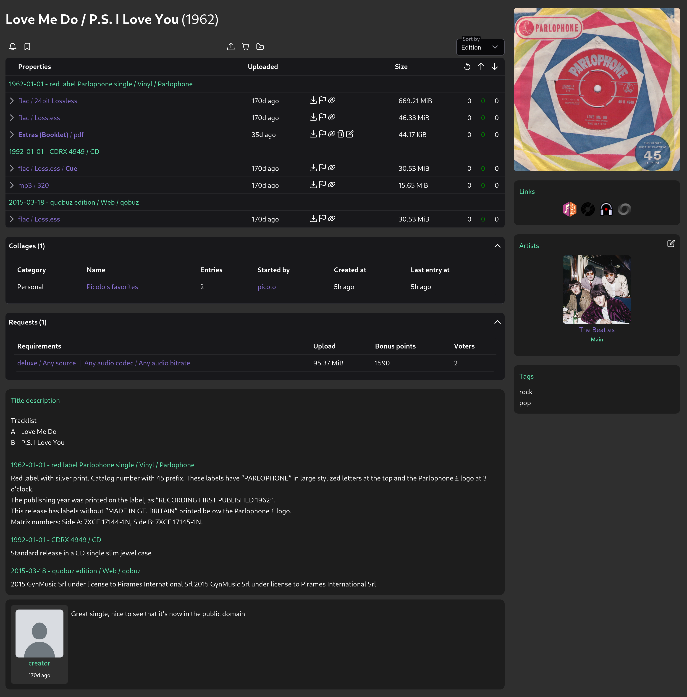
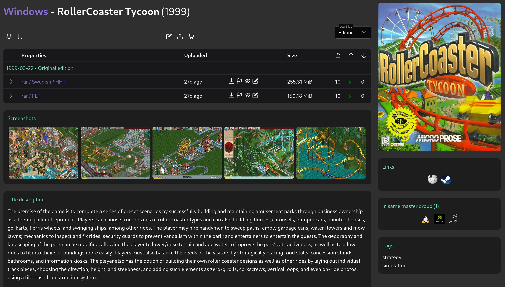
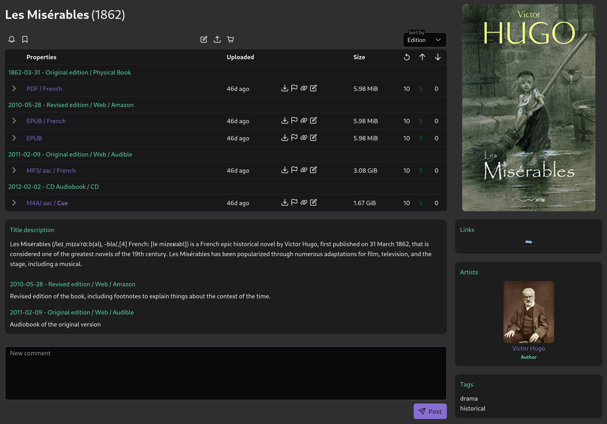
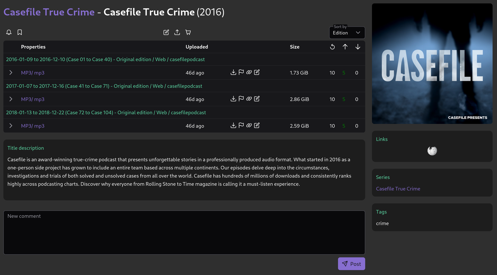

# Introduction

Arcadia is a comprehensive torrent platform designed to be:
- Easy to setup - Get running quickly with minimal configuration
- Highly configurable - Customize the platform to your needs
- Content agnostic - Support for movies, TV shows, music, books, software, and more
- Well organized - Clean, intuitive interface for both users and administrators

The backend is built with Rust for speed and safety. The frontend is built with Typescript and VueJS, rendered client-side.

## What Arcadia Supports

Arcadia supports a wide variety of content types including:

### Movies
- **Feature Film**: Full-length films with rich metadata support.
- **Short Film**: Shorter cinematic works.

    
    
<em>Movie entry</em>

### TV Shows
- Series and seasons with episode tracking capabilities.

    
    
<em>TV Show - Season entry</em>

    
    
<em>TV Show - Series view</em>

### Music
- **Album**: Includes "live album" as an "edition."
- **EP**: Extended plays.
- **Single**: Individual tracks.
- **Soundtrack**: Music from movies, TV shows, or games.
- **Anthology**: Collections of works by an artist or group.
- **Compilation**: Curated collections of tracks.
- **Remix**: Reimagined versions of original tracks.
- **Bootleg**: Unofficial recordings.
- **Mixtape**: Curated playlists or unofficial releases.
- **Concert Recording**: Live performance recordings.
- **DJ Mix**: Continuous mixes by DJs.

    
    
<em>Music</em>

### Software
- **Game**: Video games of all genres.
- **Program**: Applications and utilities.

    
    
<em>Software - Game</em>

### Written Documents
- **Book**: Includes hardcover, paperback, and digital formats.
- **Illustrated**: Includes mangas, comics, and visual novels.
- **Periodical**: Newspapers, magazines, and journals.
- **Article**: Studies, theses, essays, and research papers.
- **Manual**: Guides, music sheets, and instructional documents.

    
    
<em>Book - Entry view</em>

    
    
<em>Book - Illustrated</em>

    
    
<em>Book - Series view</em>

### Collections
Collections represent a "grouping" of content to avoid multiple uploads and reduce tracker load. Examples include site dumps, full/finished series, and monthly/yearly content groupings.

    
    
<em>Podcast collection</em>

## Community

For contributions see [CONTRIBUTING.md](contributing.md)

Join our community:
- **Discord**: [Join our server](https://discord.gg/amYWVk7pS3)
